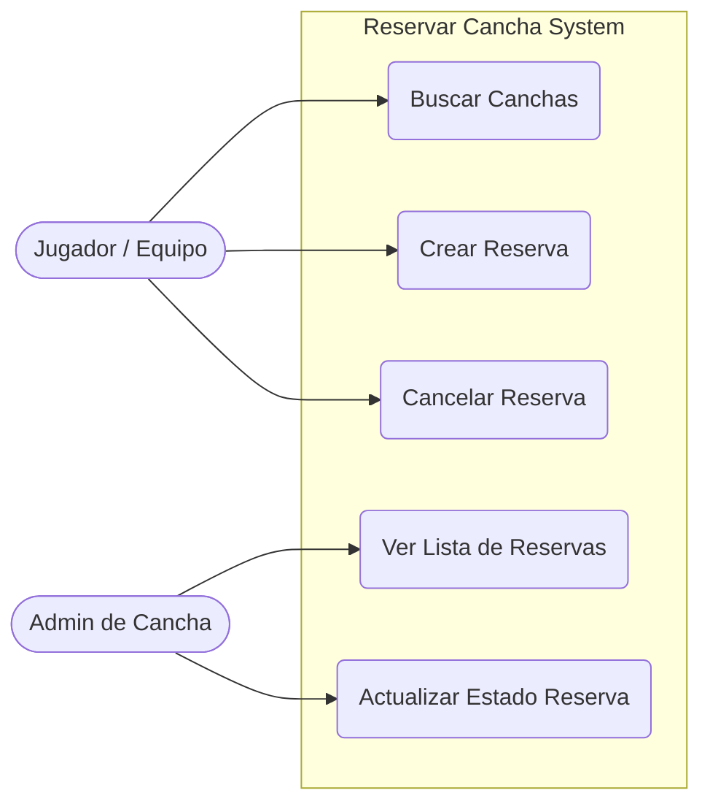
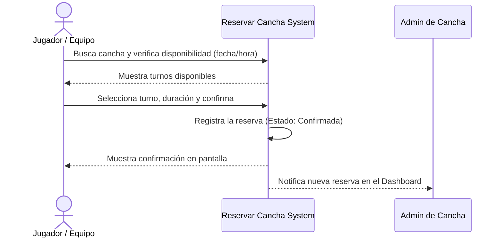
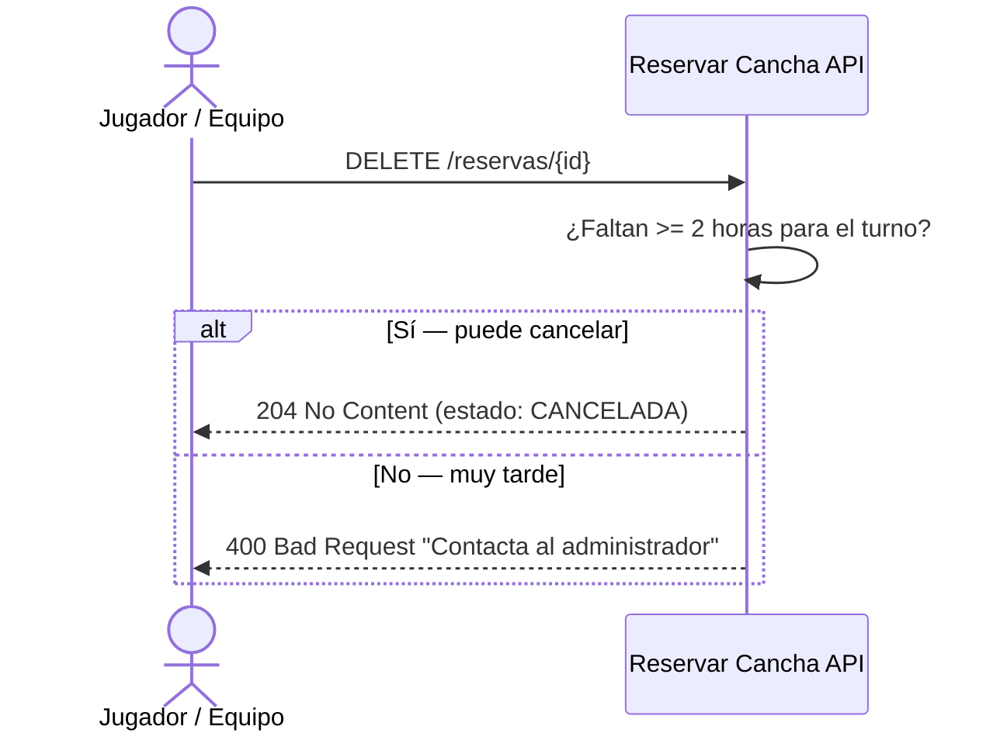

# System Brief: Reservar Cancha

## 1. Visión y Problema
**Problema:** Los jugadores y equipos de fútbol tienen dificultades para reservar canchas en horarios convenientes mediante llamadas telefónicas (líneas ocupadas o sin respuesta). Por otro lado, los administradores de canchas pierden reservas por mala gestión o ausencias (no-shows) de equipos que no pudieron cancelar a tiempo, y no cuentan con un control digital eficiente de la disponibilidad de sus canchas.

**Visión:** Crear "Reservar Cancha", una plataforma web intuitiva que permita a los jugadores y equipos encontrar y reservar canchas de fútbol en tiempo real, mientras otorga a los administradores de canchas un panel centralizado para gestionar los turnos y optimizar la ocupación de sus instalaciones.

## 2. Stakeholders (Partes Interesadas)
- **Jugadores / Equipos (Usuarios Finales):** Quienes buscan y reservan turnos en canchas de fútbol.
- **Administradores de Cancha:** Personal de la instalación que revisa y gestiona la disponibilidad diaria de las canchas.
- **Administrador del Sistema:** Equipo técnico que mantiene la plataforma e incorpora nuevas canchas al sistema.

## 3. Scope / No-Scope (Alcance)

### In-Scope (Dentro del alcance - MVP)
- Registro y autenticación básica de usuarios y administradores de cancha.
- Búsqueda de canchas por nombre o ubicación.
- Creación de reservas (selección de fecha, hora y duración del turno).
- Cancelación de reservas por parte del usuario.
- Panel de control (Dashboard) visual para el administrador con la lista de reservas diarias por cancha.
- Cambio de estado de la reserva por parte del administrador (Completada, Cancelada, No-Show).

### Out-of-Scope (Fuera del alcance - Por ahora)
- Pagos o cobros por adelantado integrados en la aplicación (pasarela de pagos).
- Alquiler de equipamiento deportivo (pelotas, pecheras, etc.).
- Integración con sistemas de caja o facturación de las instalaciones.
- Analíticas avanzadas o reportes de ingresos financieros.

## 4. Diagramas de Arquitectura / Casos de Uso (Mermaid)

### Casos de Uso del MVP



### Flujo Básico de Creación de Reserva



### Flujo de Cancelación de Reserva



---

## 5. Arquitectura de la API (MVP Técnico)

### Capa de la API REST

```
┌─────────────────────────────────────────────┐
│         CLIENTE (Web / Aplicación)          │
│            Consume la API REST              │
└───────────────────┬─────────────────────────┘
                    │ HTTP / JSON
┌───────────────────▼─────────────────────────┐
│          API REST — FastAPI                 │
│                                             │
│  ┌──────────────┐   ┌────────────────────┐  │
│  │   /canchas   │   │    /reservas       │  │
│  │  GET (buscar)│   │  POST (crear)      │  │
│  │  GET /{id}   │   │  GET  (panel)      │  │
│  │  GET /dispon.│   │  PATCH /estado     │  │
│  └──────────────┘   │  DELETE (cancelar) │  │
│                     └────────────────────┘  │
│       Validación Pydantic · Reglas Negocio  │
└───────────────────┬─────────────────────────┘
                    │
┌───────────────────▼─────────────────────────┐
│            Almacenamiento                   │
│   In-Memory dict (MVP) → PostgreSQL (v2)    │
└─────────────────────────────────────────────┘
```

### Endpoints del MVP

| Método | Ruta | Historia | Descripción |
|--------|------|----------|-------------|
| `GET` | `/canchas?nombre=` | HU-01 | Buscar canchas por nombre |
| `GET` | `/canchas/{id}` | HU-01 | Detalle de una cancha |
| `GET` | `/canchas/{id}/disponibilidad` | HU-02 | Verificar horario disponible |
| `POST` | `/reservas` | HU-02 | Crear reserva |
| `GET` | `/reservas` | HU-04 | Panel admin con filtros |
| `GET` | `/reservas/codigo/{codigo}` | HU-02 | Consultar por código |
| `PATCH` | `/reservas/{id}/estado` | HU-06 | Actualizar estado (Admin) |
| `DELETE` | `/reservas/{id}` | HU-03 | Cancelar reserva |

---

## 6. Modelo de Datos

### Cancha
| Campo | Tipo | Descripción |
|---|---|---|
| `id` | string | Identificador único |
| `nombre` | string | Nombre de la cancha |
| `ubicacion` | string | Dirección / sector |
| `tipo_superficie` | enum | CESPED_NATURAL / CESPED_SINTETICO / CEMENTO |
| `precio_por_hora` | float | Precio en moneda local |
| `capacidad_jugadores` | int | Número máximo de jugadores |
| `activa` | bool | Si está habilitada para reservas |

### Reserva
| Campo | Tipo | Descripción |
|---|---|---|
| `id` | string | UUID único |
| `cancha_id` | string | Referencia a Cancha |
| `nombre_equipo` | string | Nombre del equipo o jugador |
| `telefono_contacto` | string | Contacto del responsable |
| `fecha` | date | Fecha del turno |
| `hora_inicio` | string | HH:MM |
| `hora_fin` | string | Calculado: hora_inicio + duración |
| `duracion_horas` | int | 1 a 4 horas |
| `estado` | enum | CONFIRMADA / CANCELADA / FINALIZADA / NO_SHOW |
| `total` | float | precio_hora × duración |
| `codigo_reserva` | string | Código único (RC-XXXXXXXX) |
| `created_at` | datetime | Timestamp de creación |

---

## 7. Stack Tecnológico (MVP)

| Componente | Tecnología |
|---|---|
| Lenguaje | Python 3.10+ |
| Framework API | FastAPI |
| Validación | Pydantic v2 |
| Documentación automática | Swagger UI (`/docs`) |
| Almacenamiento MVP | In-Memory (dict) |
| Servidor | Uvicorn |
