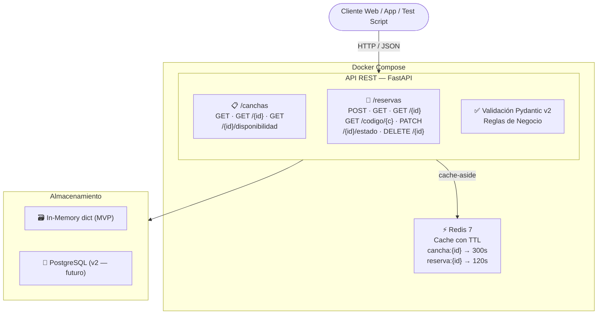

# Arquitectura: Reservar Cancha API

## 1. Resumen

API REST construida con **FastAPI** (Python 3.10+). La validación de datos se realiza con **Pydantic v2**, garantizando tipado estricto y mensajes de error claros. El almacenamiento en esta versión MVP es en memoria (diccionarios Python), con proyección a migrar a PostgreSQL en versiones futuras. La documentación interactiva se genera automáticamente siguiendo el estándar **OpenAPI 3.1**.

---

## 2. Stack Tecnológico

| Componente | Tecnología |
|---|---|
| Lenguaje | Python 3.12 |
| Framework API | FastAPI |
| Validación | Pydantic v2 |
| Almacenamiento MVP | In-Memory (dict) |
| Cache | Redis 7 |
| Servidor | Uvicorn |
| Contenedores | Docker + Docker Compose |
| Documentación | OpenAPI 3.1 / Swagger UI |

---

## 3. Diagrama de Capas



---

## 4. Endpoints del MVP

| Método | Ruta | Historia | Descripción |
|--------|------|----------|-------------|
| `GET` | `/canchas` | HU-01 | Buscar/listar canchas por nombre |
| `POST` | `/canchas` | HU-01 | Registrar nueva cancha |
| `GET` | `/canchas/{id}` | HU-01 | Detalle de una cancha |
| `GET` | `/canchas/{id}/disponibilidad` | HU-02 | Verificar horario disponible |
| `POST` | `/reservas` | HU-02 | Crear reserva |
| `GET` | `/reservas` | HU-04 | Panel admin con filtros |
| `GET` | `/reservas/{id}` | HU-02 | Obtener reserva por ID |
| `GET` | `/reservas/codigo/{codigo}` | HU-02 | Buscar reserva por código RC-XXXXXXXX |
| `PATCH` | `/reservas/{id}/estado` | HU-06 | Actualizar estado (Admin) |
| `DELETE` | `/reservas/{id}` | HU-03 | Cancelar reserva |

---

## 5. Modelo de Datos

### Cancha

| Campo | Tipo | Descripción |
|---|---|---|
| `id` | string | Identificador único |
| `nombre` | string | Nombre de la cancha |
| `ubicacion` | string | Dirección / sector |
| `tipo_superficie` | enum | CESPED_NATURAL / CESPED_SINTETICO / CEMENTO |
| `precio_por_hora` | float | Precio en moneda local por hora |
| `capacidad_jugadores` | int | Número máximo de jugadores |
| `descripcion` | string | Descripción opcional |
| `activa` | bool | Si está habilitada para reservas |

### Reserva

| Campo | Tipo | Descripción |
|---|---|---|
| `id` | string | UUID único |
| `cancha_id` | string | Referencia a Cancha |
| `nombre_equipo` | string | Nombre del equipo o jugador |
| `telefono_contacto` | string | Contacto del responsable |
| `fecha` | date | Fecha del turno (YYYY-MM-DD) |
| `hora_inicio` | string | HH:MM |
| `hora_fin` | string | Calculado: hora_inicio + duración |
| `duracion_horas` | int | 1 a 4 horas |
| `estado` | enum | CONFIRMADA / CANCELADA / FINALIZADA / NO_SHOW |
| `total` | float | precio_hora × duración |
| `codigo_reserva` | string | Código único (RC-XXXXXXXX) |
| `created_at` | datetime | Timestamp de creación |

---

## 6. Reglas de Negocio

- No se permiten dos reservas que se superpongan en el mismo horario y cancha → `409 Conflict`.
- El jugador solo puede cancelar si faltan **al menos 2 horas** para el turno → `400` si no.
- El precio se calcula automáticamente: `precio_por_hora × duracion_horas`.
- No se puede modificar una reserva con estado `CANCELADA`.
- Transiciones válidas de estado: `CONFIRMADA → FINALIZADA / NO_SHOW / CANCELADA`.

---

## 7. Decisión Arquitectónica Justificada

### Decisión: Almacenamiento en memoria (In-Memory) para el MVP

**Contexto:** El MVP necesita demostrar el flujo completo de reservas sin tiempo de configuración de base de datos.

**Decisión tomada:** Se usa un diccionario Python (`dict`) como almacenamiento temporal en lugar de una base de datos relacional.

**Justificación:**
- Permite ejecutar la API con un solo comando (`uvicorn main:app --reload`) sin instalar ni configurar PostgreSQL.
- Reduce la complejidad del MVP, permitiendo enfocarse en la lógica de negocio y los endpoints.
- Los modelos Pydantic ya están definidos con los tipos correctos, por lo que migrar a PostgreSQL en v2 solo requiere agregar un ORM (SQLAlchemy) sin cambiar la lógica de negocio.

**Trade-off aceptado:** Los datos se pierden al reiniciar el servidor. Esto es aceptable en el MVP porque el objetivo es validar el flujo, no la persistencia.

**Plan de evolución:**
```
MVP (actual)         →   v2 (futuro)
In-Memory dict       →   PostgreSQL + SQLAlchemy
Redis cache          →   Redis Cluster (alta disponibilidad)
Sin autenticación    →   JWT / OAuth2
```

---

## 8. Responsabilidades por Bloque

| Bloque | Responsabilidad |
|---|---|
| **Cliente** | Consume la API vía HTTP/JSON (browser, app, script de pruebas) |
| **FastAPI** | Enrutamiento, manejo de peticiones y respuestas HTTP |
| **Pydantic v2** | Validación y tipado de datos de entrada y salida |
| **Lógica de Negocio** | Detección de conflictos, regla de 2h, cálculo de precios |
| **Redis** | Cache de consultas frecuentes (`GET /canchas/{id}`, `GET /reservas/{id}`) con TTL |
| **Almacenamiento** | Persistencia en memoria (MVP) → PostgreSQL (v2) |

---

## 9. Códigos de Respuesta

| Código | Significado | Cuándo ocurre |
|---|---|---|
| `200 OK` | Éxito | GET exitoso |
| `201 Created` | Creado | POST /reservas exitoso |
| `204 No Content` | Sin contenido | DELETE exitoso |
| `400 Bad Request` | Error de negocio | Cancelación < 2h, reserva finalizada |
| `404 Not Found` | No encontrado | Cancha o reserva inexistente |
| `409 Conflict` | Conflicto | Horario ya reservado |
| `422 Unprocessable Entity` | Validación | Datos inválidos (Pydantic) |
